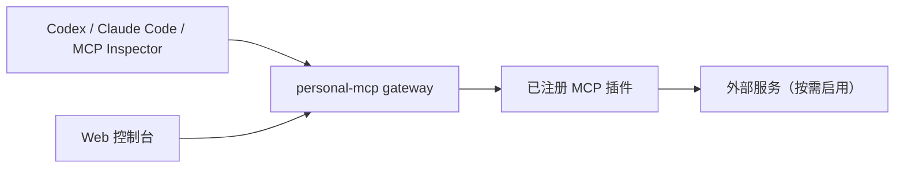

<div align="center">


# personal-mcp

一个面向本地使用的 TypeScript MCP 网关，在统一控制台中发现、配置和管理 MCP 工具。


[](LICENSE)

[快速开始](#快速开始) · [客户端接入](#客户端接入) · [添加新 MCP](#添加新-mcp) · [安全说明](#安全说明)

</div>

`personal-mcp` 将多个 MCP 插件挂载到同一个仅监听 loopback 的 HTTP 服务，并提供响应式 Web 控制台、运行时配置热重载、健康检查和请求日志。每个插件也可以作为独立服务运行。

> [!WARNING]
> 当前服务没有身份认证，只允许监听 `127.0.0.1`。请勿将端口直接暴露到局域网或公网。

## 功能亮点

- **统一网关**：通过一套服务暴露多个 Streamable HTTP MCP endpoint。
- **可视化配置**：在 Web 控制台中管理插件配置，无需重启 Node.js 进程。
- **按需启用**：MCP 默认关闭，可在控制台中按需开启。
- **安全默认值**：限制 loopback 监听；SSH 强制白名单和 host key 校验；Kubernetes 服从只读 RBAC；敏感运行时配置不进入 Git。
- **可观测性**：提供状态、可选的插件健康检查及带 `request_id` 的策略化结构化日志。

## MCP 管理

网关不会在 README 中维护固定的 MCP 清单。启动后，打开 Web 控制台的 MCP 表格即可查看当前已注册的 MCP、endpoint、配置状态、健康状态和启停状态。

MCP 默认处于关闭状态。开启后才接受客户端调用；关闭的 MCP endpoint 会返回 `503`。

## 工作方式



## 快速开始

### 环境要求

- Node.js 20 或更高版本
- npm
- 至少一个需要接入的目标服务

### 安装并启动

```bash
git clone https://github.com/luozijian1990/personal-mcp.git
cd personal-mcp
npm ci
npm run dev
```

打开 <http://127.0.0.1:3100/>。网关可以在尚未配置插件时启动；进入对应 MCP 的详情页填写配置，然后点击“保存并重载 MCP”。

默认地址：

| 服务 | 地址 |
| --- | --- |
| Web 控制台 | <http://127.0.0.1:3100/> |
| 服务状态 | <http://127.0.0.1:3100/api/status> |
| 健康检查 | <http://127.0.0.1:3100/health> |

### 配置

推荐通过 Web 控制台完成首次配置。也可以复制脱敏模板，或在首次启动时传入环境变量：

```bash
cp .runtime-config.example.json .runtime-config.json
```

| 插件 | 主要环境变量 |
| --- | --- |
| SSH | `SSH_MCP_ALLOWED_TARGETS`、`SSH_MCP_USERNAME`、`SSH_MCP_PORTS`、`SSH_MCP_PRIVATE_KEY_PATH`、`SSH_MCP_KNOWN_HOSTS_PATH` |
| Prometheus | `PROMETHEUS_MCP_URL`、`PROMETHEUS_MCP_QUERY_TIMEOUT` |
| MySQL | `MYSQL_HOST`、`MYSQL_PORT`、`MYSQL_USER`、`MYSQL_PASSWORD`、`MYSQL_DATABASE` |
| Jenkins | `JENKINS_URL`、`JENKINS_USER`、`JENKINS_TOKEN` |
| Kubernetes | `KUBERNETES_KUBECONFIG_PATH`、`KUBERNETES_CONTEXT`、`KUBERNETES_DEFAULT_NAMESPACE` |

控制台保存的值写入 `.runtime-config.json`，后续启动时优先于同名环境变量。该文件以 `0600` 权限写入并已被 `.gitignore` 排除。可通过 `MCP_RUNTIME_CONFIG_PATH` 更改保存位置。

> [!TIP]
> 各字段含义、完整示例和插件特有约束，请查看对应插件文档：[Kubernetes](src/plugins/kubernetes/README.md)、[Jenkins](src/plugins/jenkins/README.md)、[SSH](src/plugins/ssh/README.md)、[Prometheus](src/plugins/prometheus/README.md)、[MySQL](src/plugins/mysql/README.md)。

## 客户端接入

网关启动后，可将任意 endpoint 添加到 MCP 客户端：

```bash
# 使用控制台 MCP 表格中的 endpoint
codex mcp add <plugin-id> --url http://127.0.0.1:3100/<plugin-id>/mcp
claude mcp add --transport http <plugin-id> http://127.0.0.1:3100/<plugin-id>/mcp
```

也可以使用 MCP Inspector 调试 endpoint：

```bash
npx @modelcontextprotocol/inspector http://127.0.0.1:3100/ssh/mcp
```

## 添加新 MCP

普通插件接入只需要新增插件实现，并在 [`src/plugins/catalog.ts`](src/plugins/catalog.ts) 注册一份 `PersonalMcpPluginDefinition`；Gateway、HTTP Runtime 和 UI 主逻辑不需要增加插件分支。

1. 在 `src/plugins/<plugin-id>/` 定义 metadata、配置字段、配置解析/校验和 MCP Server 工厂。
2. 为每个 Tool 声明 `risk`、确认/默认关闭提示，以及输入和输出日志策略。
3. 使用 `toolSuccessResult`、`toolTextResult`、`toolStructuredResult` 和 `toolErrorResult` 返回一致的 MCP 结果，同时保留领域自己的 `outputSchema`。
4. 如有安全、无副作用的后端探测，实现可选的 `checkHealth(signal)`。
5. 在 Catalog 注册 Definition，并设置 standalone 默认端口；需要独立启动命令时，再添加一个调用 `startStandalonePlugin` 的薄入口。

完整 Contract、配置生命周期、Secret 语义、Profile 和 Mock Kubernetes 扩展清单见 [Plugin Development](docs/PLUGIN-DEVELOPMENT.md)。

## 安全说明

- SSH 仅允许访问显式配置的目标，不传递密码、不关闭 host key 检查，也不会自动接受未知指纹。
- `ssh_execute_command` 默认关闭；启用后，客户端仍需传入 `acknowledgeRemoteChangeRisk: true`。
- MySQL 的 `execute_sql` 可以修改数据，请使用权限最小化的专用数据库账号。
- Runtime 按 Tool 的 `full`、`metadata`、`redacted` 或 `none` 策略分别记录输入和输出，并始终对已配置 Secret 做中央脱敏；日志仍应按敏感数据管理。
- `.runtime-config.json`、日志、构建产物和本地 SSH identity 文件均不会被 Git 跟踪。

## 开发

```bash
# 构建前端和服务端，并运行测试
npm run check

# 仅构建
npm run build

# 运行构建产物
npm start
```

项目主要目录：

```text
src/
├── apps/       # 网关与独立服务入口
├── core/       # Runtime 启动、HTTP、插件注册、结果、日志和运行时配置
├── plugins/    # 各服务的 MCP 插件
└── ui/         # React Web 控制台
```

插件作者请从 [Plugin Development](docs/PLUGIN-DEVELOPMENT.md) 开始；本轮框架重构的架构、兼容性和验证记录见 [Framework Refactor Result](HANDOFF-MCP-FRAMEWORK-REFACTOR-RESULT.md)。
